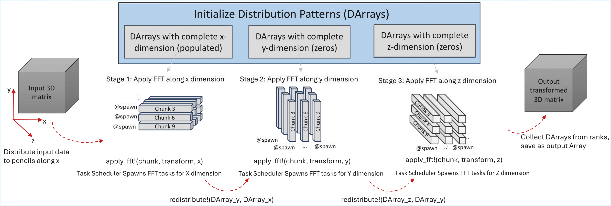

# DaggerFFT.jl
Scalable distributed FFT implementation for heterogeneous CPU/GPU systems, built on Dagger.jl



> **Figure:** Task-scheduled 3D FFT implementation using pencil decomposition, asynchronous transforms, and data movement.

## Installation

```julia
using Pkg
Pkg.add("DaggerFFT")
```

Or from the Julia REPL:

```julia
] add DaggerFFT
```

## Usage

### 3D Complex-to-Complex FFT & IFFT (CPU)

```julia
using DaggerFFT

A = rand(ComplexF64, 128, 128, 128)
F = fft(A; decomp=Pencil(), dims=(1,2,3))
A_recon = ifft(F; decomp=Pencil(), dims=(1,2,3))
```

### 3D Real-to-Complex RFFT & IRFFT (CPU)

```julia
using DaggerFFT

A = rand(256, 256, 256)
F = rfft(A; decomp=Pencil(), dims=(1,2,3))
A_recon = irfft(F, size(A, 1); decomp=Pencil(), dims=(1,2,3))
```

### 3D Complex FFT & IFFT (GPU - CUDA)

```julia
using DaggerFFT
using CUDA

A = CUDA.rand(ComplexF64, 256, 256, 256)
F = fft(A; decomp=Slab(), dims=(1,2,3))
A_recon = ifft(F; decomp=Slab(), dims=(1,2,3))
```

### 2D Real-to-Real FFT (CPU)

```julia
using DaggerFFT
using FFTW

A = rand(256, 256)
F = fft(A; decomp=Slab(), transforms=(R2R((FFTW.REDFT10, FFTW.REDFT10)),), dims=(1,2))
A_recon = ifft(F; decomp=Slab(), transforms=(R2R((FFTW.REDFT01, FFTW.REDFT01)),), dims=(1,2))
```


@article{anvari2026daggerfft,
  title   = {DaggerFFT: A Distributed FFT Framework Using Task Scheduling in Julia},
  author  = {Anvari, Sana Taghipour and Samaroo, Julian and Raayai Ardakani, Matin and Kaeli, David},
  journal = {arXiv preprint arXiv:2601.12209},
  year    = {2026},
  doi     = {10.48550/arXiv.2601.12209}
}

